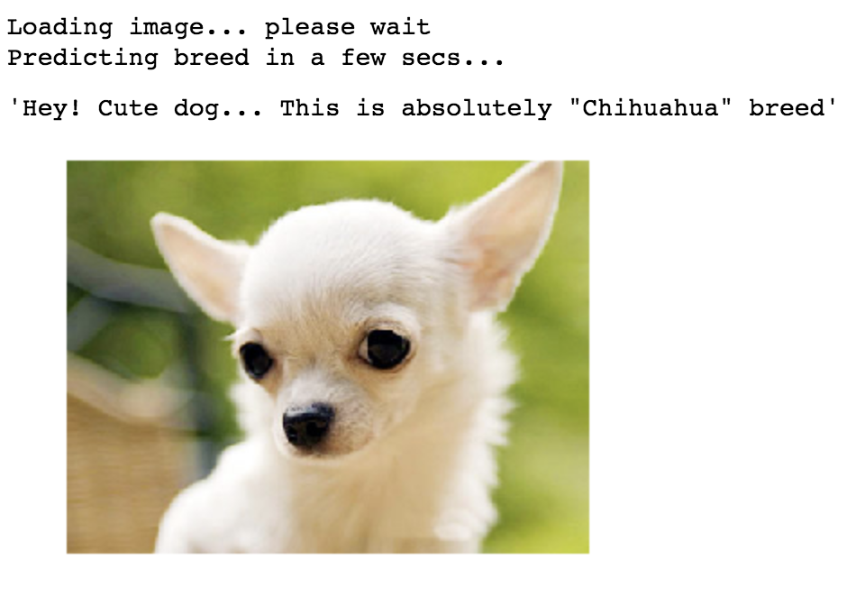
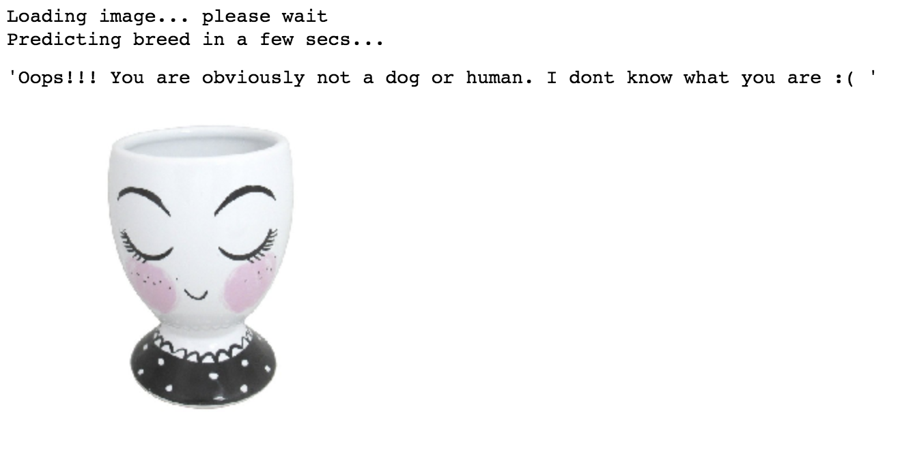

# Machine Learning Engineer Nanodegree
# Model Evaluation and Validation

### Submission Files for the Project: Write an Algorithm for a Dog Identification App

#### This project built a CNN that predicts dog's breed(s)

##### The model accepts an image file, it determines if the image is a dog or human or neither.
  - If the image is a dog, it returns the predicted breed
  - If the image is a dog and a mixed breed, it returns the top(3) predicted breed
  - If the image is a human, it returns the predicted breed the human image looks like
  - If the image is neither a dog nor human, it returns an error message to the user

#### Below are some examples I used to test the model
  
  
  
  
  
  
